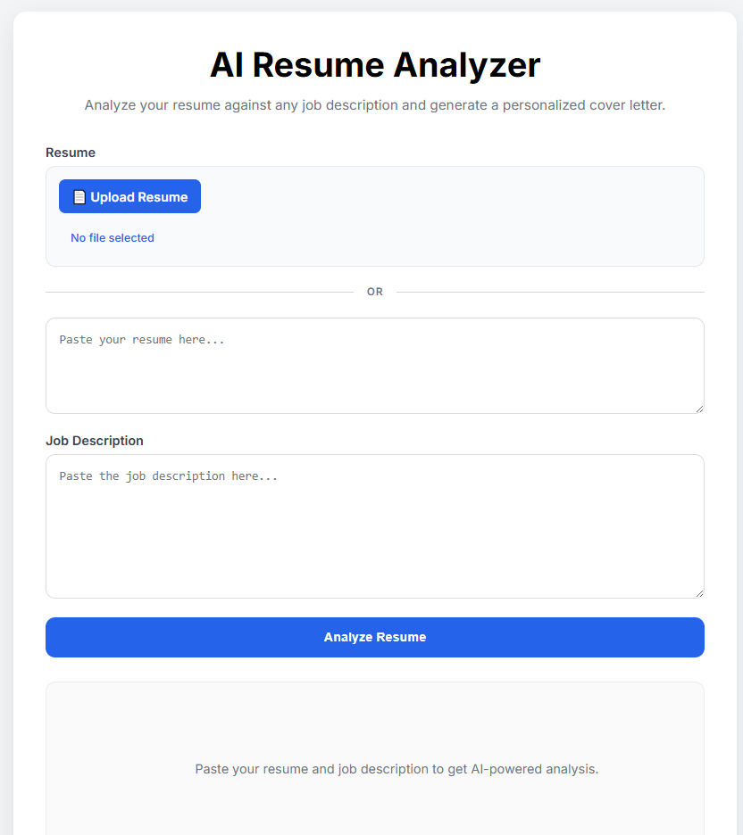
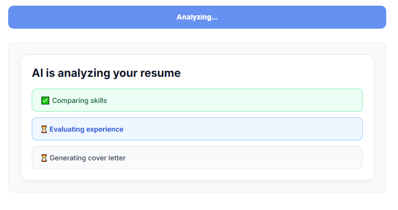
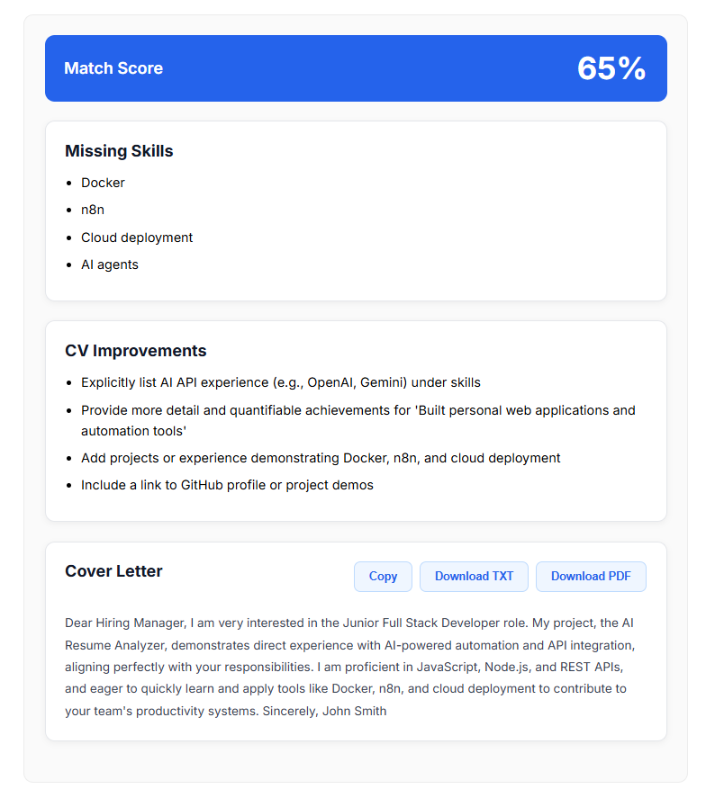
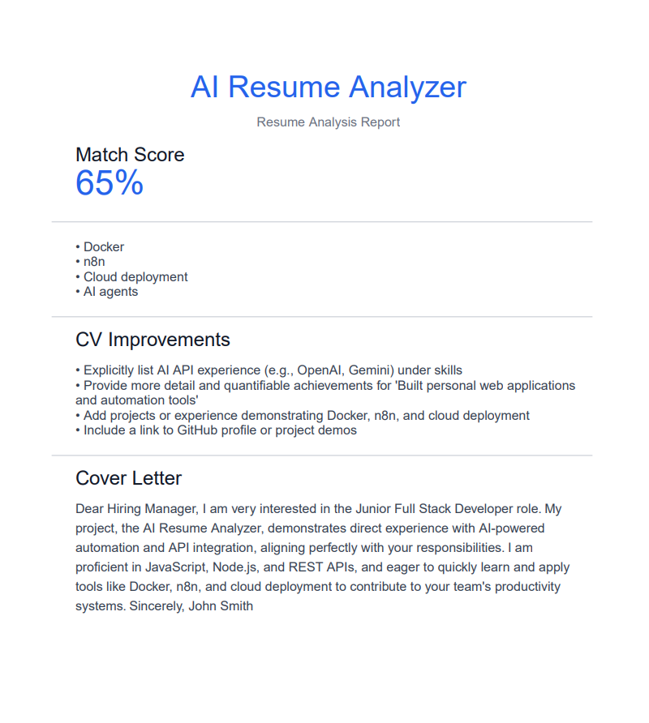

# AI Resume Analyzer

Analyze your resume against any job description using AI.

Upload a PDF or DOCX resume, compare it with a job posting, receive a match score, identify missing skills, and generate a personalized cover letter instantly.

## Live Demo

**Application:** https://ai-job-assistant-vjjk.onrender.com

**GitHub Repository:** https://github.com/Dilanpol/ai-resume-analyzer

---

## Features

* Upload resumes in **PDF** or **DOCX** format
* Paste resume text manually
* Analyze resumes against any job description
* Generate a **Match Score**
* Detect missing skills and qualifications
* Suggest CV improvements
* Generate a personalized AI cover letter
* Copy cover letter to clipboard
* Export cover letter as TXT
* Export analysis report as PDF

---

## Tech Stack

### Frontend

* HTML5
* CSS3
* Vanilla JavaScript

### Backend

* Node.js
* Express.js

### AI

* Google Gemini API

### File Processing

* Multer
* Mammoth (DOCX parsing)
* PDF-Parse

### PDF Generation

* PDFKit

### Deployment

* Render

---

## How It Works

1. Upload a resume (PDF or DOCX) or paste resume text manually.
2. Paste a job description.
3. Click **Analyze Resume**.
4. The application:

   * Extracts resume content
   * Compares it with the job description
   * Calculates a match score
   * Identifies missing skills
   * Generates improvement suggestions
   * Creates a personalized cover letter
5. Export the results as PDF or TXT.

---

## Screenshots

### Home Screen


### Analysis in Progress


### Analysis Results


### PDF Report


---

## Demo Video

Watch the project demo:

https://youtu.be/swjfmpomR0c

---

## Local Setup

Clone the repository:

```bash
git clone https://github.com/Dilanpol/ai-resume-analyzer.git
cd ai_job_assistant
```

Install dependencies:

```bash
npm install
```

Create a `.env` file:

```env
GEMINI_API_KEY=your_api_key_here
```

Start the application:

```bash
npm start
```

Open:

```text
http://localhost:3000
```

---

## Future Improvements

* Analysis history
* Multiple report templates
* Better PDF formatting
* Enhanced prompt engineering
* User authentication
* Resume optimization suggestions

---

## Author

Created as a portfolio project to demonstrate:

* AI integration
* File processing
* Backend development
* Frontend development
* PDF generation
* Deployment and production setup